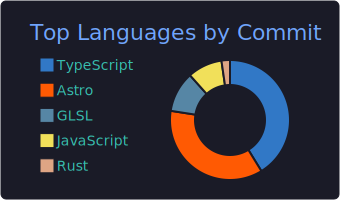

##  Hi there
> トラマト - 寅松 - ToraMutton

- 🐾 I'm a first-year student at the UEC, enjoying learning various technologies.
- ⚙️ I have a custom-built PC assembled in February 2026 that dual-boots Windows 11 and Arch Linux.
- 🔭 Updating my personal homepage toramutton.me using Astro!
- 🐧 I'm learning Rust and JavaScript while customizing Arch Linux to my liking.
- 📫 **Find me online:**

  
  
  
   
  
  
  

 

## 🛠️ Tech Stack & Arsenal

  

 

## 📊 GitHub Stats & Activity

  
  
    

  
  

